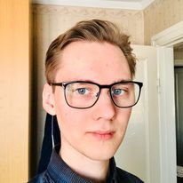
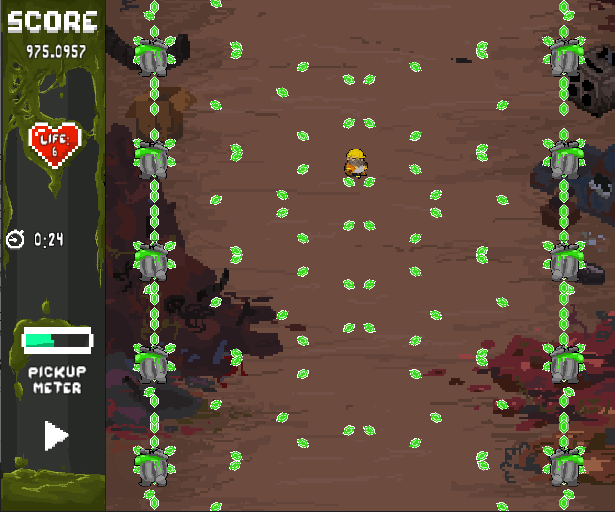

# About me
Hello, I'm Robin Sollfors, I'm a 24 year old from sweden and I studied game development and programming in Skövde University and this is my portfolio  
  
I'm a programmer who went to the Univerity of Skövde to study game programming for three years.  

## Programming languages:
### Most experience
- C#
- C++

### Lesser Experience
- Assembly
- GLSL
- Java
- C  

## Previous game projects

### T.R.A.S.H.
T.R.A.S.H. is a bullet hell game developed by nine students from Skövde University during the course "Game Development Project 1" during our first year  
Link: [Drive](https://drive.google.com/file/d/1pCr_dDzFhynWTRUnARX_zlLDBr2qERPG/view)  

### Galactic Dance Off
Galactic Dance Off is a rhythm based game developed by thirteen students from Skövde University during the course "Game Development Project 2" during our second year  
Links: [Game awards](https://www.gameawards.se/Games/2019/Galactic-Dance-Off)  
[Facebook](https://www.facebook.com/NepTunesEntertainment/)  
[Homepage](https://awombatplayinggames.itch.io/galactic-dance-off)

    
  
  
## VR  
I have previously worked with VR in Unity by myself.  
My master thesis was also about how the different movement systems in VR affected the symptoms of Cybersickness in the user. Where cybersickness is the term used for motion sickness when using VR.  
### Bow  
The bow string can be pulled back only if the hand not holding the bow is either empty or holding an arrow.  
The bow can either shoot the arrow by either pressing the trigger button or letting go of the arrow when it is pulled back.  
The speed of the arrow is dependant on how far back the arrow is pulled.  
The arrow can also be unhooked from the string if the arrow is not pulled back far enough and the trigger button is pressed.  
  

### Realistic Rifle  
The rifle can be aimed with two hands.  
The rifle has a charging handle that you can use to put one bullet from the magazine into the chamber, or remove/replace the bullet if there is a bullet already in the chamber. The rifle also can't be fired unless there is a bullet in the chamber. Meaning that even if the magazine is full but there is no bullet chambered, it will not start fiering.  
The magazines can be released from the gun as well as reinserted and the induvidual magazines keep track of how much bullets they still have inside of them.  

  
  

## Coding examples:  
[Bow VR (C#)](Scripts/Bow.cs)  
[Realistic gun VR (C#)](Scripts/GunRealistic.cs)  
[Invader game (C++)](Scripts/Invaders)  
  
## Other links:  
[Scripts](Scripts)  
[School work during Skövde University](SchoolWork_Projects)
